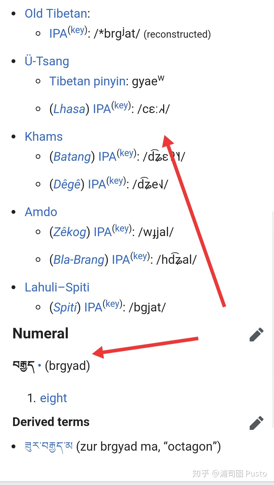
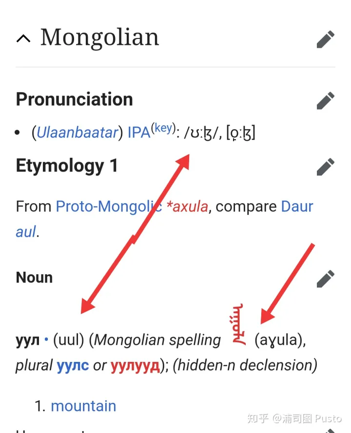
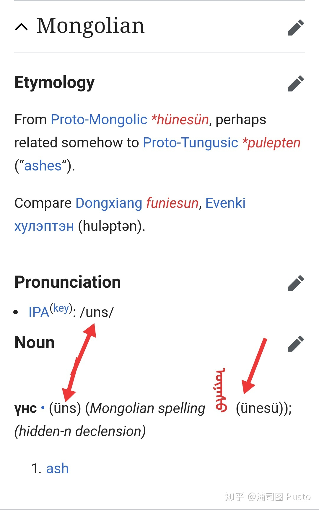

- [法文](#法文)
- [藏文](#藏文)
- [传统蒙文](#传统蒙文)

*（原文发表在知乎同名问题 [有哪些离谱的字母组合读音？ - 知乎](https://www.zhihu.com/question/390338591/answer/1177950021) ）*

# 法文

首先想到法文~（下图来自微博@语言学bot）

当然，在法文、英文、藏文等文字中还能举出很多例子。老表音文字了。

---

# 藏文

补充一下大家比较熟悉的藏文和传统蒙文。它们大体上是比较完整地保留了古代的发音，但是现代发音变化太大，正字法又没怎么变，于是看起来就很离谱。（虽然情有可原，但现代非母语者学起来就是很离谱啊Orz）

藏文：

上面这个是藏文「བརྒྱད」，意为数词「八」，与汉语的「八」同源，从字面来看是「brgyad」这么几个部件（包含上加字下加字以及不带附标时的默认元音），现代拉萨话发音是 /cɛː˩˧˨/。 本来巨发达的辅音丛和尾辅音很多都没了，而且演变的结果是辅音元音乍看上去都不太像原本的辅音元音了，并且拼写里没有哪个部件专门表示声调，要从语音演变规律推导出声调。

# 传统蒙文

上面是蒙文「 ᠠᠭᠤᠯᠠ 」，意思是「山」，字面上来看是「aɣula」这么几个部件，但现在发音（各地发音不尽相同，维基词典上估计是乌兰巴托口音，供参考）是 [o̙ːɮ]，外蒙一般用的西里尔字母是按发音转写的，所以写成「уул」。

上面这个是传统蒙文「 ᠦᠨᠡᠰᠦ 」，意思是「灰烬」，各个部件直接转写成拉丁字母是「ünesü」，但后面几个元音都不发音了，现代发音是 /uns/，西里尔字母写成「үнс」。

听说外蒙想逐步扩大传统蒙文的使用范围，但让习惯了拼读一致的普通民众学会补充那些不发音的元音和辅音字母，估计有些难度吧。

另外，刚刚看到微博上 Yuggu 前辈说

> ᠶᠠᠭᠠᠬᠢᠪᠠᠴᠤ(yaγaxibaču) > яавч “不管怎样也……，无论如何”口语里省了好多音啊

我不太懂蒙古语，只能说这个例子更凶残，五个音节直接变成一个了（а在这里表示长音吧），不知道在其他长词中能不能找到更凶残的。

*社会，社会 [抱拳] 老表音文字了。*
