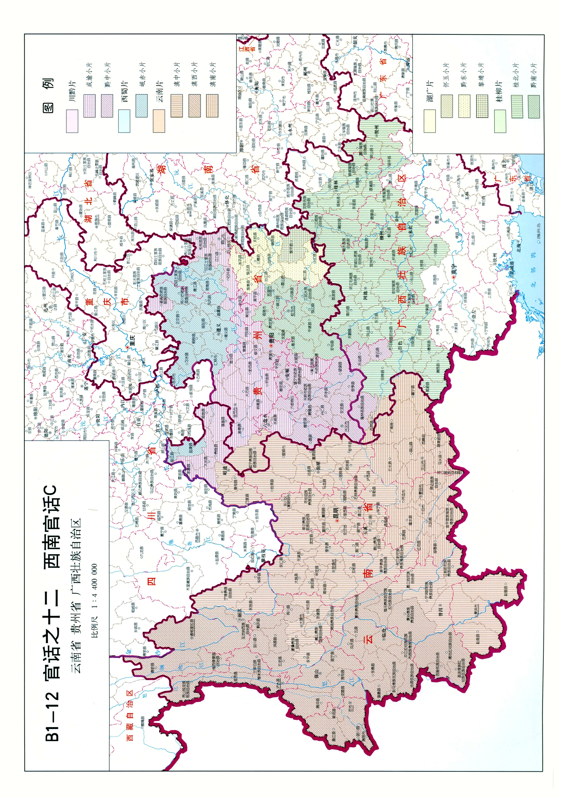
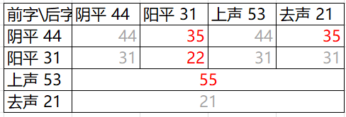
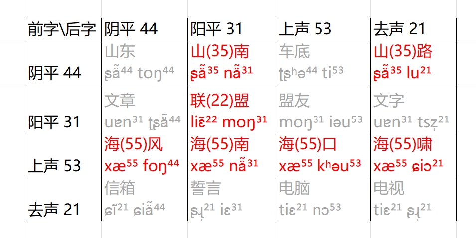

因为爱情，加上我对语言和语言学很感兴趣，因此随缘学习昆明话~随缘更新昆明话学习记录。

# 基本思想

简单提一下一些基本思想。

我的主要目标不是快速熟练掌握这门方言，而是在逐渐熟悉的同时增进我和爱人以及我所喜欢的语言学、音韵学的感情。个人条件上，我也没有条件花大量时间实践练习，但我有少许的语言学以及音韵学基础，而且母语是同为汉语族的官话之一的普通话。

因此我目前不会像上语言课一样练习很多情景对话或者题目，但我会运用一些理论知识来帮助学习，并从中发现乐趣。

调值及音标的标注仅供参考。

# 昆明方言简介

昆明话属于汉语族-官话-西南官话-云南片-滇中小片。

我向爱人学习的是市区非官渡区的方言。

下面先学习声调。

# 调类

简而言之，昆明话共有阴平、阳平、上声、去声四个声调，这四个声调与普通话的四个声调同名，而且所辖的字大体相同（最大的不同在于入声的归派不同，以后讲）。

因此第一步可以先学习这四个声调在昆明话中的发音。

# 调值

根据《中国方言地图集》，昆明话四个声调的调值：

- 阴平（一声） 44 （普通话为 55）
- 阳平（二声） 31 （普通话为 35）
- 上声（三声） 53 （普通话为 214）
- 去声（四声） 212 （普通话为 51）

调类|	昆明话调值|	普通话调值|	示例
-|-|-|-
阴平|	44|	55|	山-大山
阳平|	31|	35|	盟-联盟
上声|	53|	214|	海-大海
去声|	212|	51|	誓-发誓

入声：在昆明话里派入阳平。

去声的单字调为212，但在词语中只读下降的部分 21，或许因为读成曲折的 212 很费力。

可以观察到昆明话的一个特点就是降调多，基本只有阴平是平的，其他三个都是高低不同的降调。阴平、上声比较高，阳平、去声比较低，恍惚间有点粤语的感觉（不是）。

# 单字调示例

下面是一些针对性的例子。重点关注词语中的后字，因为前字的声调会改变，后字不会，前字的改变我们下面再讲。标注本人的木头耳朵识别到的最可爱最美丽的昆明美少女的发音，使用国际音标（IPA）。

例字|	例字音标|	例词|	例词音标|	备注
-|-|-|-|-
山|	ʂä̃⁴⁴|	大山|	tɒ²¹ ʂä̃⁴⁴|	阴平
盟|	moŋ³¹|	联盟|	liɛ̃²² moŋ³¹|	阳平
海|	xæ⁵³|	大海|	tɒ²¹ xæ⁵³|	上声
誓|	ʂɻ̩²¹²|	发誓|	fɒ³¹ ʂɻ̩²¹|	去声

# 连读变调之双字调

在昆明话中，两个字组成词时，前一个字的声调会在原本声调的基础上，根据后一个字的声调发生改变。

昆明话两个字的连读音变的调值总结为图。灰色表示未变，红色表示变化。

前字阴平的原始调值为44，若后字为阳平（31）、去声（21），则前字变为35。

前字阳平的原始调值为31，若后字也为阳平，则前字变为22。

前字上声的原始调值为53，只要跟后面的字组成词语，前字就变为55。

前字去声的原始调值为21（如上所说，单字为212，词语中为21），组成词语也不会改变。

# 双字调的小观察

阴低升，阳阳平，上高调，去不变。

总得来说，阴平在遇到两个较低的声调（阳平31、去声21）时从平调44变为声调35，阳平在遇到又一个阳平时从降调31变为平调22，上声遇到谁都变为55，去声遇到谁都不变。

阴平读成升调在我看来是个很西南官话的事（题外话，这也是河南话区别于菏泽话的重要方面），尤其是比较强势的成渝小片就有这个特征，因此昆明话的阴平在连读变调时读成升调也很自然；这一变化只在后字是两个调值低的声调时出现，或许可以理解为突出对比？

等我再学一学可以写一些对比昆明话和成都话重庆话的笔记。

阳平遇到阳平变成平调，可以理解为两个31比较费力，所以变得更平缓。

上声只要做前字就变成55，也可以记忆为上声原本就是最高（最靠上，上声的本义）的，只是在做后字时读成降调。

去声不变。

一些示例如图。

# 三字词的连读变调？

在我刚以为连读音变整理完的时候，学到了一个词：

冰（阴平，35）淇（阳平，22）淋（阳平，31）

其中后两个字和单念「麒麟」的读音是一样的，可见都是阳平（因为我说普通话的时候经常把「冰淇淋」的「淇」念成阴平，所以确认一下）。

这个例子是否说明在更多字组成的词中，当前字依然根据自己的调类以及后继字的调类来决定自己的声调，即使后继字已经发生了变调？可能需要更多例子来检验。
